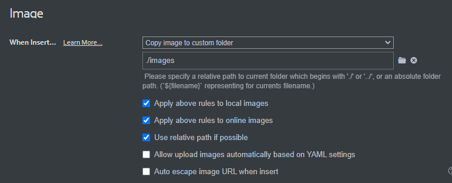
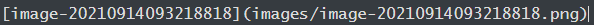

# Hướng dẫn cập nhật tài liệu sử dụng phần mềm quản trị - Ban CNTT

Repository này được tạo ra với mục đích xây dựng tài liệu hướng dẫn sử dụng phần mềm. Giúp người dùng dễ dàng tiếp cận các sản phẩm của Ban CNTT. Dưới đây là các lưu ý khi cập nhật hướng dẫn sử dụng phần mềm.
* Trang preview: https://viettel-ess.github.io/ESS-System-Guide
 
## Cấu trúc project 

    mkdocs.yml    # File cấu hình.
    docs/
        index.md  # Trang chủ giới thiệu.
        hrm       # Thư mục theo từng phân hệ (Nhân sự, Kế toán, SaaS Portal, Digital Workplace, Văn phòng...)
            introduction.md             # Giới thiệu chung về phân hệ
            initialization.md           # Thiết lập và khai báo ban đầu
            abbreviations.md            # Thuật ngữ và từ viết tắt
            master-datas.md             # Khai báo danh mục 
            log-histories.md            # Lịch sử phát triển phân hệ
            employee.md,recruitment.md  # Mô tả các module trong phân hệ
            images/                     # Lưu trữ hình ảnh đính kèm

## Cấu trúc Menu một phân hệ

File cấu hình: mkdocs.yml

    - 'Nhân sự': 
            - 'Giới thiệu về phân hệ Quản lý nhân sự': 'hrm/introduction.md'
            - 'Thiết lập và khai báo ban đầu': 'hrm/initialization.md'
            - 'Các thuật ngữ và từ viết tắt': 'hrm/abbreviations.md'
            - 'Hướng dẫn sử dụng chức năng':
                - 'Khai báo danh mục': 'hrm/master-datas.md'
                - 'Tuyển dụng': 'hrm/recruitment.md'
                - 'Nhân viên': 'hrm/employee.md'
           	- 'Lịch sử phát triển sản phẩm': 'hrm/log-histories.md'
## 3. Sử dụng công cụ Typora 

Trang chủ: [https://typora.io/](https://typora.io/)

Hướng dẫn sử dụng Markdown cơ bản: [https://support.typora.io/Markdown-Reference/](https://support.typora.io/Markdown-Reference/)

Một số thao tác với hình ảnh với Typora: [https://support.typora.io/Images/](https://support.typora.io/Images/)

### Một số lưu ý

1. Các đầu mục lớn phải đặt format Headings, bắt đầu từ h1 -> h6
2. Các đầu mục lớn không cần đánh số chỉ mục như 1,1.1,... Chỉ phân cấp qua Headings. Recommend sử dụng tab **Outline** trên **Sidebar** của Typora để quản trị tốt hơn. 

### Cấu hình upload  hình ảnh  đính kèm

> **Cấu hình cho phép end user chỉ cần paste hoặc Drag & Drop 1 ảnh bất kỳ, Typora sẽ tự copy ảnh vào phân vùng lưu trữ & gắn path đến phân vùng đó.**
>
> **Tất cả các đường dẫn hình ảnh đính kèm bắt buộc cấu hình ở dạng tương đối (relative path).**

Chọn: Format → Image → When Insert Local Images → Global Image Settings.

Cấu hình như hình dưới.



Sau khi cấu hình xong, test lại đường dẫn relative path như hình dưới là OK.




### Cú pháp

1. Redirect link
   ```
    - Trường hợp mong muốn redirect đến các đầu mục trong cùng 1 site:
        + Xác định được id của đầu mục cần redirect đến. (Xác định được id của đầu mục đó).
        + Rồi sử dụng cú pháp: [tại đây](#id_can_redirect_toi).
            # Good
              **[tại đây](#kinh-nghiem-ky-nang)**
            # Bad
              **[tại đây](#Kinh nghiệm & Kỹ năng)*
    ```  
    ```
    - Trường hợp mong muốn redirect đến các site khác và đến các đầu mục cụ thể:
        + Xác định cấp url và id của đầu mục cần redirect tới. 
        + Sử dụng cú pháp [tại đây](../../url#id_can_redirect_toi).
           Ví dụ: ../../saas/saas/#bat-dau-su-dung-he-thong-vess 
    ```

2. Đánh số chỉ mục
   ```
    - Giữa các chỉ mục từ cấp đầu tiên đến cấp cuối cùng thì cần viết đúng cú pháp. Giữa 2 cấp liên tiếp nhau thì các chỉ mục con cần tab vào đầu dòng để phân biệt với các chỉ mục cha.
    - Ví dụ:
    # Good
    1. Đầu mục 1
        * Nội dung 1.1
            * Nội dung 1.1.1
        * Nội dung 1.2
            * Nội dung 1.2.1
    2. Đầu mục 2
        * Nội dung 2.1
            * Nội dung 2.1.1
        * Nội dung 2.2
            * Nội dung 2.2.1
    # Bad
    1. Đầu mục 1
    * Nội dung 1.1
        * Nội dung 1.1.1
    * Nội dung 1.2
        * Nội dung 1.2.1
    2. Đầu mục 2
    * Nội dung 2.1
        * Nội dung 2.1.1
    * Nội dung 2.2
        * Nội dung 2.2.1
   ```
3. Đặt headings
   ```
    - Trong 1 file .md heading bắt đầu từ h1, và chỉ duy nhất có 1 h1 trong file
   ```
