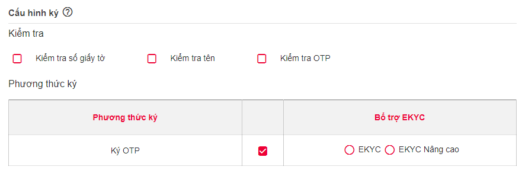
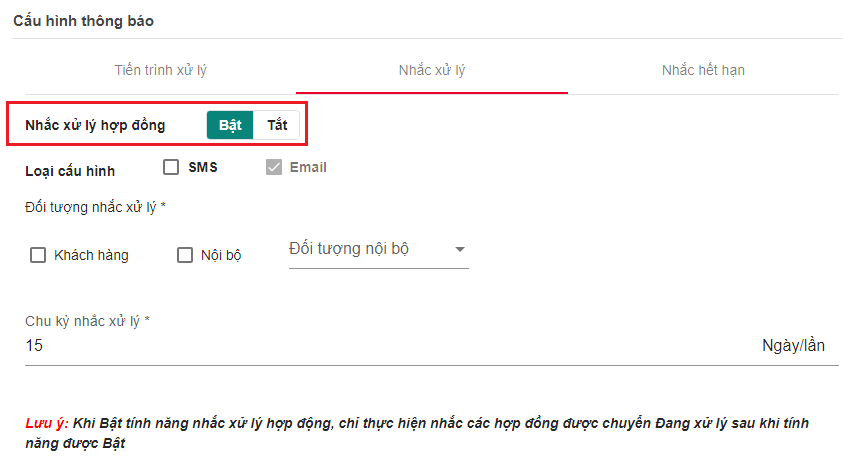
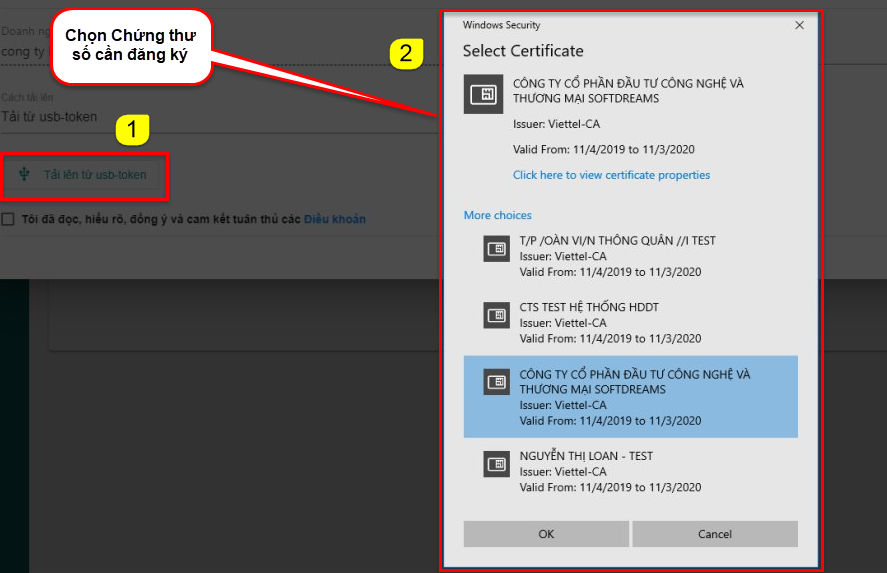
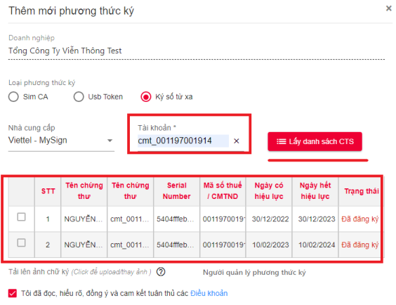
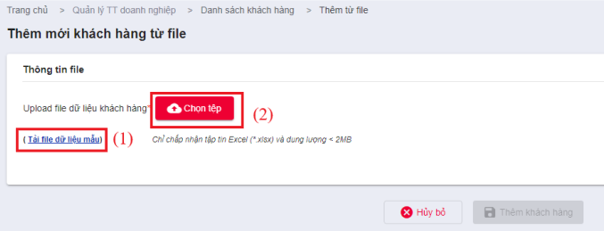
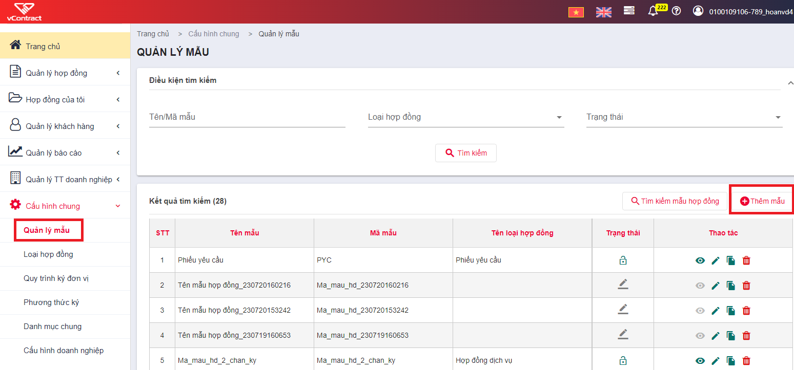
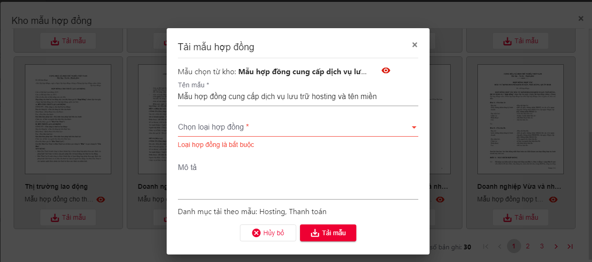
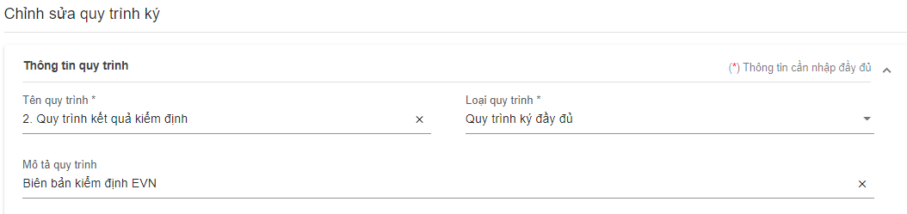
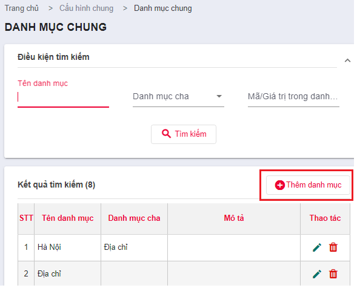
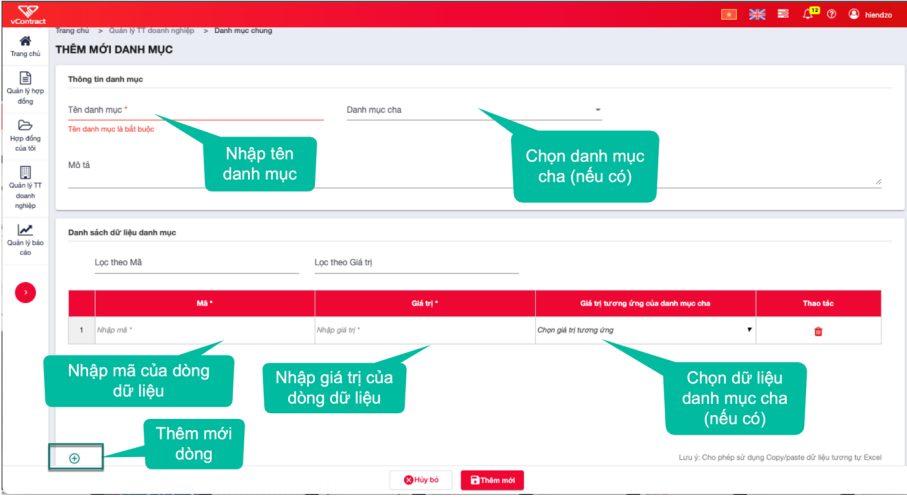

## **Cấu hình trước khi sử dụng**

### **Thiết lập Loại Hợp Đồng**

<iframe width="100%" height="315" src="https://www.youtube.com/embed/hzohbt0v3FI?si=UN9So5585lChyQF4" title="YouTube video player" frameborder="0" allow="accelerometer; autoplay; clipboard-write; encrypted-media; gyroscope; picture-in-picture; web-share" allowfullscreen></iframe>

- **Loại hợp đồng**: dùng để phân nhóm các hợp đồng của đơn vị, hỗ trợ cho tìm kiếm và cấu hình các chức năng khác trong hệ thống.
- **Hệ thống quy định**: mỗi đơn vị sử dụng dịch vụ có ít nhất 1 loại hợp đồng, các chủ thể là khách hàng cuối chỉ thực hiện ký hợp đồng không thực hiện các chức năng này.
- Các bước thiết lập loại hợp đồng:

  - **Bước 1**: Chọn menu chính "Cấu hình chung" => "Loại hợp đồng" => Thêm mới loại hợp đồng

  

  - **Bước 2**: Điền các thông tin sau:
    - Mã loại hợp đồng: ký hiệu mã
    - Tên loại hợp đồng: tên dạng text
    - Ghi chú: nếu có
    - Cấu hình mã số tự động:
      - Nếu người dùng muốn thiết lập Mã hợp đồng trước: thực hiện chọn Bật, tùy chọn các loại cần cấu hình như: Dải số, thời gian, mã loại hợp đồng, nhập liệu và chọn định dạng cho từng loại.
      - Nếu người dùng không muốn thiết lập sẵn Mã hợp đồng: chọn chế độ tắt và thực hiện điền mã hợp đồng tại menu Tạo hợp đồng.

- **Bước 3**: Cấu hình ký
  - Ký điện tử: Cấu hình cho phép / không cho phép khách hàng cá nhân ký hợp đồng chỉ bằng vẽ / upload ảnh chữ ký điện tử.
  - Kiểm tra số giấy tờ: Cấu hình kiểm tra / không kiểm tra Số giấy tờ chủ thể trong chứng thư số trùng với Số giấy tờ của chủ thể tham gia ký khi các chủ thể ký bằng CA.
  - Kiểm tra tên: Cấu hình kiểm tra / không kiểm tra Tên chủ thể trong chứng thư số trùng với Tên của chủ thể tham gia ký khi các chủ thể ký bằng CA.
- Kiểm tra OTP: Cấu hình kiểm tra / không kiểm tra Số điện thoại đã thực hiện ký OTP là Số điện thoại của khách hàng cá nhân được thiết lập trong luồng ký.
- Ký OTP: Cấu hình cho phép / không cho phép khách hàng cá nhân ký hợp đồng bằng xác nhận qua OTP.
- Bổ trợ EKYC: Chỉ hiển thị khi người dùng cấu hình OTP hoặc cấu hình ký điện tử. Cấu hình ký bổ trợ EKYC cho phương thức ký cá nhân.
- Bổ trợ EKYC Nâng cao: Chỉ hiển thị khi người dùng cấu hình OTP hoặc cấu hình ký điện tử. Cấu hình ký bổ trợ EKYC Nâng cao cho phương thức ký cá nhân.

- **Bước 4**: Cấu hình thông báo
  - Cấu hình tiến trình xử lý: nếu người dùng muốn bật thông báo gửi SMS khi xử lý hợp động thì có thể chọn đối tượng gửi là Khách hàng hoặc nội bộ doanh nghiệp.
    
  - Nhắc xử lý: Hệ thống tự động nhắc nhờ người ký/phê duyệt thực hiện ký nếu hợp đồng chưa hoàn tất. Người dùng thực hiện thiết lập chi kỳ nhắc nhở xử lý.
    
  - Nhắc hết hạn hợp đồng: Người dùng thiết lập thời hạn và chu kỳ nhắc nhở thông minh hợp đồng sắp hết hạn về tin nhắn và mail cho chủ thể ký.
    

### **Thiết lập Phương Thức Ký**

<iframe width="100%" height="315" src="https://www.youtube.com/embed/OlvAV7xSi9s?si=AkRfIAqLiYOoy4AY" title="YouTube video player" frameborder="0" allow="accelerometer; autoplay; clipboard-write; encrypted-media; gyroscope; picture-in-picture; web-share" allowfullscreen></iframe>

- **Phương thức ký**: là hình thức ký số mà đơn vị sử dụng để ký hợp đồng.
- **Hệ thống quy định**:
  - Đơn vị tham gia ký kết là doanh nghiệp/tổ chức >> bắt buộc ký bằng CA (USB Token, Sim CA, Cloud CA).
  - Đơn vị tham gia ký kết là cá nhân >> có thể ký bằng CA (USB Token, Sim CA, Cloud CA) hoặc OTP.
  - Các bước thiết lập phương thức ký:
    - **Bước 1**: Chọn menu chính "Cấu hình chung" (menu trái)
    - **Bước 2**: Chọn menu chức năng "Phương thức ký"
    - **Bước 3**: Click nút "Thêm mới"
    - **Bước 4**: Điền thông tin 1 hình thức ký >> Click "Lưu"
       Ngoài ra, người dùng có thể thiết lập nhanh Phương thức ký trên trực tiếp trang ký 1 hợp đồng (tương đương bước 4)
      

#### **Đăng ký phương thức ký USB TOKEN**

**Yêu cầu:** Máy tính của người dùng đã nhận và sử dụng được usb bình thường; có chứng thư số hợp lệ - còn hạn trong đó.

**Các bước thực hiện:**

- **Bước 1** : Tại cột **Loại phương thức ký** chọn **USB TOKEN** >> Chọn "Tải lên từ usb-token".
  
- **Bước 2** : Click "Tải lên từ USB-token" >> Chọn chức thư số cần thêm mới.
  
- **Bước 3** :Hiển thị thông tin Chứng thư số đã chọn >> Đọc thông tin điều khoản sử dụng và tích vào checkbox "tô đã đọc..." >> nhấn "Lưu"
 **->** Sau khi thêm thành công, chứng thư số sẽ được thêm vào phần danh sách phương thức ký.

#### **Đăng ký phương thức ký SIM CA**

**Yêu cầu:** Sim của người dùng là simCA, có chứng thư số hợp lệ - còn hạn trong đó.

**Các bước thực hiện:**

- **Bước 1** : Tại cột **Loại phương thức ký** chọn **SIM CA**.

  

- **Bước 2** : Tại cột **Số điện thoại**: Nhập số điện thoại chứa chứng thư số cần đăng ký.
- **Bước 3** : Nhấn "Lấy danh sách CTS" >> tích chọn Chứng thư số cần đăng ký trong danh sách.
- **Bước 4** : Đọc thông tin điều khoản sử dụng và tích chọn "Tôi đã đọc..." >> nhấn "Lưu" để thêm mới.
 **->** Sau khi thêm thành công, chứng thư số sẽ được thêm vào phần danh sách phương thức ký.

#### **Đăng ký phương thức ký CloudCA**

**Yêu cầu:** Tài khoản của người dùng là Chứng thư số mysign, có chứng thư số hợp lệ - còn hạn trong đó.

**Các bước thực hiện:**

- **Bước 1** : Tại cột **Loại phương thức ký** chọn **Ký số từ xa**.
- **Bước 2** : Chọn nhà cung cấp dịch vụ là Viettel-Mysign và điền thông tin tài khoản mysign => Click kấy danh sách CTS.
- **Bước 3** : Hệ thống view ra các CTS mà Khách hàng đã đăng ký, tiến hành chọn mặc định CTS sử dụng.
  

### **Quản lý khách hàng**

#### **Thêm mới một khách hàng**

- **Bước 1** : Vào menu "Quản lý khách hàng" hoặc "Danh sách khánh hàng", thực hiện "Thêm mới".
- **Bước 2** : Điền các thông tin sau:
  

  - **Thông tin khách hàng:**
    - Loại khách hàng: bắt buộc
    - Tên khách hàng: bắt buộc
    - Ngày sinh (Đối với loại khách hàng là cá nhân): không bắt buộc
    - Giới tính (Đối với loại khách hàng là cá nhân): không bắt buộc
    - Loại giấy tờ: bắt buộc
    - Số giấy tờ: bắt buộc
    - Ngày cấp: bắt buộc
    - Nơi cấp: bắt buộc
    - Mã số thuế: không bắt buộc
  - **Thông tin liên hệ:**
    - Tỉnh/Thành phố: bắt buộc
    - Quận/Huyện: bắt buộc
    - Phường/Xã:  bắt buộc
    - Địa chỉ: bắt buộc
    - Email: bắt buộc
    - Điện thoại: bắt buộc
    - Fax: không bắt buộc
  - **Thông tin người đại diện (Đối với loại khách hàng là tổ chức):**
    - Họ và tên: bắt buộc
    - Chức vụ: bắt buộc
    - Ngày sinh: không bắt buộc
    - Giới tính: không bắt buộc
    - Loại giấy tờ: không bắt buộc
    - Số giấy tờ: không bắt buộc
    - Ngày cấp: không bắt buộc
    - Nơi cấp: không bắt buộc
  - **Thông tin thanh toán:**
    - Ngân hàng: không bắt buộc
    - Số tài khoản: không bắt buộc
    - Chi nhánh: không bắt buộc
  - **Tệp đính kèm:**

  **Ghi chú:** Những trường có chứa kí tự (\*) là bắt buộc.

- **Bước 3** : Click vào nút **Lưu** để hoàn thành.
- **Bước 4** : Sau khi thêm mới khách hàng thành công, hệ thống sẽ thực hiện gửi tài khoản đăng nhập vào hệ thống cho khách hàng qua email.

#### **Thêm mới danh sách khách hàng**

- **Bước 1** : Vào menu "Danh sách khách hàng", thực hiện "Thêm từ file".
  
- **Bước 2** : Người dùng thực hiện tải file dữ liệu mẫu về (1), điền các thông tin trong file excel mẫu.
- **Bước 3** : Sau khi hoàn thiện (1), thực hiện upload file dữ liệu lên tại (2).
  

### **Thiết lập Mẫu Hợp Đồng**

<iframe width="100%" height="315" src="https://www.youtube.com/embed/j5QbhbT4VCo?si=Fr1KB0mMPz-bEZ28" title="YouTube video player" frameborder="0" allow="accelerometer; autoplay; clipboard-write; encrypted-media; gyroscope; picture-in-picture; web-share" allowfullscreen></iframe>

- **Quản lý mẫu:** Cho phép nhân viên đơn vị thiết lập nhanh hợp đồng, không cần soạn thảo sẵn tại máy tính.
- Đơn vị có thể tùy chọn sử dụng Mẫu hoặc không, hiện hệ thống có 8 mẫu cố định để đơn vị lựa chọn.
- Các bước thiết lập loại hợp đồng:

  - **Bước 1**: Chọn menu chính "Cấu hình chung" (menu trái).
  - **Bước 2**: Chọn menu chức năng "Quản lý mẫu".
    
  - **Bước 3**: Thêm hợp đồng.

- Nếu người dùng muốn sử dụng mẫu sẵn của hệ thống thì thực hiện click chọn "Tìm kiếm hợp đồng". Hệ thống sẽ view ra các hợp đồng và người dùng thực hiện Tải mẫu về.

- Nếu người dùng sử dụng mẫu thiết kế riêng và upload lên hệ thống thì thực hiện "Thêm mới".

  - (1) Tab thông tin chung: Điền loại hợp đồng, mô tả (nếu có).
  - (2) Tab Thông tin file mẫu: Upload file docx của Khách hàng.
  - (3) Tab Cấu hình thông tin trong mẫu:

    - Cấu hình nội dung: Sau khi thực hiện (2) thành công thì hệ thống sẽ show ra các trường merge field để Khách hàng kiểm tra lại thông tin và có thể thực hiện thêm mới.
    - Cấu hình: Trang ký.
    - Cấu hình luồng ký của đơn vị: Setup luồng ký áp dụng cho mẫu này.

      

### **Quy trình ký đơn vị**

<iframe width="100%" height="315" src="https://www.youtube.com/embed/vBRoYJHQpK4?si=Wgqf2GxuEEi5wbE6" title="YouTube video player" frameborder="0" allow="accelerometer; autoplay; clipboard-write; encrypted-media; gyroscope; picture-in-picture; web-share" allowfullscreen></iframe>

**Quy trình ký:** Là luồng quy trình mà đơn vị sẽ quy định áp dụng mặc định cho mọi loại hợp đồng nếu chọn quy trình này.

**Các bước thực hiện:**

- **Bước 1**: Truy cập Cấu hình chung >> Quy trình ký đơn vị >> Thêm mới quy trình.
- **Buóc 2**: Điền các thông tin:

  - Tab Thông tin quy trình: Điền thông tin quy trình, loại quy trình, mô tả (nếu có).
  - Tab Các bên ký kết hợp đồng: Người dùng thiết lập các bên tham gia ký theo thứ tự sắp xếp.

  Lưu ý: Cho phép tích hợp chọn ký KKĐN (ký không cần đăng nhập).

  

  

- **Bước 3**: Sau khi hoàn thiện quy trình ký, người dùng thực hiện click "Cập nhật quy trình" để hoàn tất.

### **Danh mục chung**

**Danh mục chung:** Đây là các bộ danh mục động để từng công ty có thể cấu hình theo nhu cầu riêng. Danh mục có thể được thiết lập mối quan hệ cha con, một danh mục con chỉ thuộc 1 danh mục cha, 1 danh mục cha có thể có nhiều con.

**Các bước thực hiện:**

- **Bước 1**: Truy cập hệ thống >> Cấu hình chung >> Danh mục chung.
  
- **Bước 2**: Thực hiện Thêm mới danh mục cần sử dụng cho mẫu như sau.
   
   - Mã danh mục: Không được nhập có khoảng trắng, bắt buộc nhập.
   - Tên: Nhập nội dung tên, bắt buộc nhập.
   - Chọn giá trị tương ứng của danh mục cha (nếu có).

Lưu ý: Trên thông tin danh mục có chọn danh mục cha thì dưới bảng có đủ dữ liệu để chọn giá trị tương ứng.
   - Các ô Mã và giá trị có thể thực hiện copy/paste từ excel sang, bạn có thể copy nhiều dòng mà không cần bấm nút "Thêm dòng".

- Với mẫu hợp đồng QRCODE trên, thì người dùng cần khai báo danh mục sau:
  - **Danh mục 1:** Hình thức thanh toán, bao gồm hai Mã - Giá trị tương ứng là:
    - TM - Thanh toán tiền mặt.
    - CK - Thanh toán chuyển khoản.
  - **Danh mục 2:** Thời hạn hợp đồng:
    - Mục đích: Khai báo lựa chọn thời hạn hợp đồng: có xác định hay không xác định thời hạn.
  - **Danh mục 3:** Danh mục gói dịch vụ:
    - Mục đích: Khai báo các dịch vụ trên hệ thống.
  - **Danh mục 4:** Danh sách gói QR code:
    - Mục đích: Khai báo các gói QR code trên hệ thống.
  - **Danh mục 5:** Đơn giá Gói dịch vụ:
    - Mục đích: Khai báo giá của dịch vụ.
    - Danh mục Đơn giá gói dịch vụ sẽ có danh mục cha là Danh mục gói Dịch vụ.
    - Người dùng sẽ khai báo tương ứng các Giá trị = Giá của sản phẩm, và có Giá trị tương ứng của danh mục cha = Tên sản phẩm.
  - **Danh mục 6:** Đơn giá dịch vụ QR Code:
    - Mục đích: Khai báo giá của dịch vụ tạo QR code.
    - Danh mục Đơn giá gói dịch vụ sẽ có danh mục cha là Danh mục gói QR Code.
    - Người dùng sẽ khai báo tương ứng các Giá trị = Giá của gói QR code và có Giá trị tương ứng của danh mục cha = Tên sản phẩm.

### **Quản lý phòng ban/chi nhánh**

Quản lý các chi nhánh của đơn vị: tìm kiếm/thêm mới/sửa chi nhanh/thiết lập trạng thái hoạt động cho chi nhánh.
Để truy cập chức năng: vào menu "Quản lý TT doanh nghiệp" >> "Quản lý phòng ban/chi nhánh".

 Người dùng thực hiện điền các thông tin: Mã phòng ban, phân loại (chi nhánh hoặc phòng ban), tên phòng ban, mô tả (nếu có).
### **Quản lý người dùng**

 <iframe width="100%" height="315" src="https://www.youtube.com/embed/hM4maNdyALY?si=Yuolo8ZJmceqYlhP" title="YouTube video player" frameborder="0" allow="accelerometer; autoplay; clipboard-write; encrypted-media; gyroscope; picture-in-picture; web-share" allowfullscreen></iframe>

Mục để doanh nghiệp quản lý người dùng của đơn vị mình. Các chức năng gồm: tìm kiếm/thêm mới/sửa thông tin người dùng/phân quyền/thiết lập trạng thái hoạt động cho người dùng.
  Để truy cập chức năng: vào menu **" Quản lý TT doanh nghiệp"** >> **"Người dùng"**.

Có 02 cách để thêm người dùng:

- **Cách 1:** Thực hiện thêm mới từng cá nhân, khách hàng điền các thông tin: email, tên đăng nhập, họ và tên, loại người dùng, số điện thoại, phòng ban,...
  
- **Cách 2:** Thực hiện import hàng loạt người dùng bằng cách "Thêm từ file".
  Tại (1) khách hàng tải file mẫu về và điền các thông tin trong file excel sau đó import lên (2).
  

### **Nhóm quyền**

 <iframe width="100%" height="315" src="https://www.youtube.com/embed/BZr3KDwXUPw?si=09pDmSFEM2_URAhs" title="YouTube video player" frameborder="0" allow="accelerometer; autoplay; clipboard-write; encrypted-media; gyroscope; picture-in-picture; web-share" allowfullscreen></iframe>

Mục để doanh nghiệp quản lý các nhóm người dùng có chung các quyền thao tác trên website dịch vụ. Các chức năng gồm: tìm kiếm/thêm mới/sửa thông tin nhóm/phân quyền/ thiết lập trạng thái hoạt động cho nhóm người dùng.

Để truy cập chức năng: vào menu "Quản lý TT doanh nghiệp" >> "Nhóm quyền".

- Tại Tab Phân quyền theo chức quyền: Thực hiện chọn quyền truy cập, sử dụng chức năng của phần mềm.
- Tại Tab Phân quyền theo dữ liệu: thực hiện bật chế độ quản lý hợp đồng để lựa chọn các thông tin.

<iframe width="100%" height="315" src="https://www.youtube.com/embed/hzohbt" title="YouTube video player" frameborder="0" allow="accelerometer; autoplay; clipboard-write; encrypted-media; gyroscope; picture-in-picture; web-share" allowfullscreen></iframe>
