## **Thao tác trên hợp đồng**

### **Lập hợp đồng chọn tệp từ máy**

<iframe width="100%" height="315" src="https://www.youtube.com/embed/XGmfVICJRB8?si=3r42BPwvd-mLb7DH" title="YouTube video player" frameborder="0" allow="accelerometer; autoplay; clipboard-write; encrypted-media; gyroscope; picture-in-picture; web-share" allowfullscreen></iframe>

- **Bước 1**: Chọn menu chính "Hợp đồng của tôi" (menu trái).
- **Bước 2**: Chọn menu chức năng "Lập hợp đồng".
  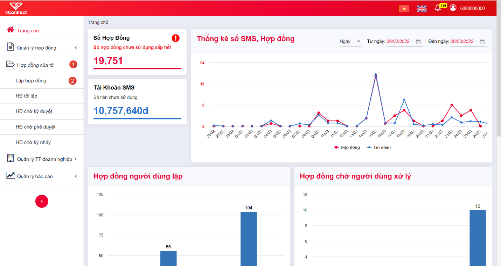

- **Bước 3**: Chọn cách lập hợp đồng: từ file pdf upload lên hoặc lập từ mẫu đã đăng ký.
- **Bước 4**: Chọn file pdf cần upload hoặc chọn Mẫu để tạo hợp đồng.
- **Bước 5**: Nhập các thông tin chung của hợp đồng: Tên, mã, loại hợp đồng,...
  
  
- **Bước 6**: Thiết lập các bên ký kết.
  - Chọn các bên tham gia ký kết: Để thêm 1 bên ký kết phải nhập đúng số giấy tờ/mã số thuế của bên tham gia ký kết >> Hệ thống hiển thị tên chủ thể cho người dùng chọn.
  - Thiết lập thứ tự ký: Nhập thứ tự ký cho từng chủ thể ở cột đầu tiên "TT ký", có thể thiết lập ký song song bằng cách đặt thứ tự ký của các chủ thể bằng nhau.
- **Bước 7**: Thiết lập luồng phê duyệt-ký duyệt của nội bộ bên lập (nếu bên lập tham gia ký kết)
  - Thêm người dùng vào luồng phê duyệt/ký duyệt bằng gõ tên/email của người dùng cần thêm >> Hệ thống hiển thị các người dùng phù hợp với nội dung nhập vào để người lập chọn.
  - Thứ tự duyệt-ký là cố định và lần lượt: Người dùng thêm vào trước luôn phê duyệt trước, người cuối cùng của luồng thực hiện chức năng ký duyệt.
    
- **Bước 8**: Click nút "Lập hợp đồng" >> Hệ thống kiểm tra và lập hợp đồng ở trạng thái **"Nháp"**.

### **Lập hợp đồng theo lô**

<iframe width="100%" height="315" src="https://www.youtube.com/embed/1UtQeEGZsOw?si=omBtmd2JwEyqdEhc" title="YouTube video player" frameborder="0" allow="accelerometer; autoplay; clipboard-write; encrypted-media; gyroscope; picture-in-picture; web-share" allowfullscreen></iframe>

- **Bước 1**: Truy cập Hợp đồng của lô >> HĐ tôi lập >> Thêm mới lô.
  
- **Bước 2**: Thực hiện chọn mẫu hợp đồng áp dụng theo lô.
  
- **Bước 3**: Thiết lập thông tin và cấu hình cho lô.
  - Tại Thông tin mẫu tạo lô (1): Người dùng thực hiện tải file excel mẫu mà hệ thống đã thiết lập sẵn, điền các thông tin yêu cầu. Và tải file excel đó lên hệ thống.
  - Tại Cấu hình luồng ký theo lô (2): Thực hiện chọn người phê duyệt, ký áp dụng xuyên suốt cho lô hợp đồng này.
  - Tại Thiết lập cấu hình chân ký (3): Đã thiết lập theo mẫu hợp đồng chọn ban đầu.
    

### **Lập hợp đồng chọn từ mẫu**

**Mục đích:** Tạo hợp đồng bằng cách chọn từ mẫu có sẵn của hệ thống, người dùng chọn mãu **->** Hệ thống bind các thông tin cần điền. Sau khi điền thông tin sẽ xuất file hợp đồng để thực hiện ký.

**Điều kiện:** Người dùng có quyền thao tác ở đơn vị.

**Các bước thực hiện:**

- **Bước 1**: Tại màn hình Trang chủ, bấm chọn Hợp đồng của tôi **->** Lập hợp đồng **->** Chọn nút **Chọn từ mẫu**.
  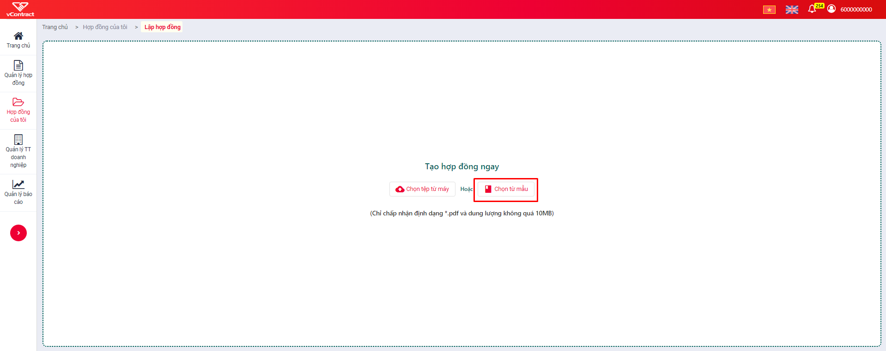
- **Bước 2**: Hệ thống hiển thị popup chọn mẫu hợp đồng. Người dùng thao tác chọn mẫu đã có bấm "Lưu".
  
- **Bước 3**: Sau khi chọn mẫu thành công, hệ thống hiển thị màn hình Nhập thông tin chung.
  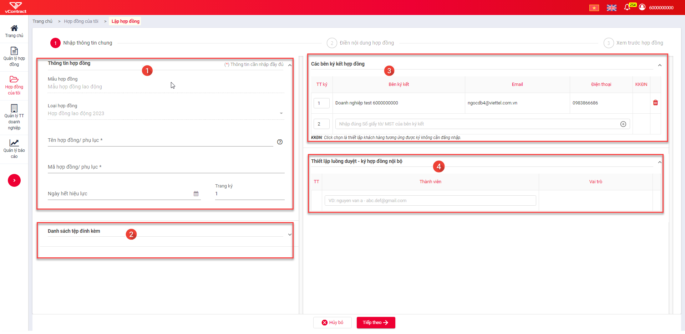

  **Trong đó:**

  **(1) Nhập thông tin chung:**

  Bao gồm:

  - Mẫu hợp đồng: Hiển thị tên mẫu hợp đồng đã chọn ở bước 1.
  - Loại hợp đồng: Hiển thị loại hợp đồng của mẫu đã chọn.
  - Tên hợp đồng/phụ lục: đây là tên của hợp đồng đang lập - bắt buộc nhập.
  - Mã hợp đồng/phụ lục: đây là mã của hợp đồng đang lập - bắt buộc nhập, không được nhập trùng, không có khoảng trắng.

  **(2) Danh sách tệp đính kèm:** Tải các tệp đính kèm - Chỉ chấp nhận tập tin PDF (_.pdf) và tập tin hình ảnh (_.jpg, _.png, _.bmp).

  **(3) Các bên ký hợp đồng:** Thiết lập các bên thực hiện ký kết hợp đồng, có 1 bên lập và nhiều bên khách hàng. Phải có ít nhất 1 đối tượng ký hợp đồng.

  - Nhập đúng số giấy tờ/Mã số thuế của bên ký kết để hệ thống suggest thông tin.

  **(4) Thiết lập luồng duyệt - ký hợp đồng nội bộ:** Yêu cầu thiết lập thành viên trong nội bộ thực hiện ký, sẽ có nhiều người duyệt nhưng chỉ có 1 người ký.

  - Nhập đúng email để suggest thông tin thành viên.

- **Bước 4**: sau khi điền thông tin và thiết lập luồng ký ở bước 2, Bấm "Tiếp theo" **->** Chuyển đến màn hình Điền nội dung hợp đồng.
  

  - Hệ thống tự động bind thông tin theo mẫu cấu hình, người dùng thực hiện điền thông tin hợp đồng tại cột **Giá trị** của bảng tại tab **Điền thông tin và tính toán**.

  - Bấm "Quay lại" để chuyển về bước 2.
  - Sau khi điền thông tin bấm Tiếp theo để đến bước 4.

- **Bước 5**: Hiển thị màn hình Xem trước hợp đồng.
  

  Trong đó:

  (1) Thông tin chung của hợp đồng - đã nhập ở bước 2. có thể chỉnh sửa.

  (2) Xem trước hợp đồng - đây là bản xem trước hợp đồng đã được map từ file mẫu của mẫu và các giá trị thông tin điền ở bước 2.

  (3) Nút **Chọn hợp đồng khác ->** Bấm vào để thực hiện chọn hợp đồng khác thay đổi hình thức lập hợp đồng sang **Chọn tệp từ máy**.

  (4) Nút **Chọn từ mẫu khác ->** bấm vào để thực hiện chọn mẫu khác.

  (5) Nút **quay lại ->** Bấm để quay lại màn hình bước 2.

  (6) Nút **Lập hợp đồng ->** Bấm để thực hiện lập hợp đồng.

- _Bước 6**: Bấm lập hợp đồng **->_ Thực hiện lưu hợp đồng ở trạng thái Nháp.

### **Chỉnh sửa hợp đồng**

**Mục đích:** Chỉnh sửa hợp đồng đã lập ở trạng thái Nháp.

**Điều kiện:** Người dùng có quyền thao tác ở đơn vị.

**Các bước thực hiện:**

- **Bước 1**: Tại menu danh mục Hợp đồng của tôi **->** Chọn Hợp đồng tôi lập. Hệ thống hiển thị màn hình Hợp đồng tôi lập.
  
- **Bước 2**: Chọn hợp đồng và bấm nút "Chỉnh sửa". Tùy hợp đồng được chọn lập theo hình thức Chọn tệp từ máy hay Chọn từ mẫu hệ thống sẽ hiển thị ra màn hình tương ứng.
  - Nếu **Chọn tệp từ máy ->** Chuyển màn hình bước 3.
  - Nếu **Chọn từ mẫu ->** Chuyển màn hình bước 1.
- **Bước 3**: Các bước tiếp theo tương tự khi Lập hợp đồng.

### **Sao chép hợp đồng**

**Mục đích:** Sao chép 1 hợp đồng đã có thành hợp đồng mới, cho phép clone thông tin của hợp đồng được sao chép để chỉnh sửa.

**Điều kiện:** Người dùng có quyền thao tác ở đơn vị.

**Các bước thực hiện:**

- **Bước 1**: Tại menu danh mục Hợp đồng của tôi **->** Chọn hợp đồng tôi lập. Hệ thống hiển thị màn hình Hợp đồng tôi lập.
  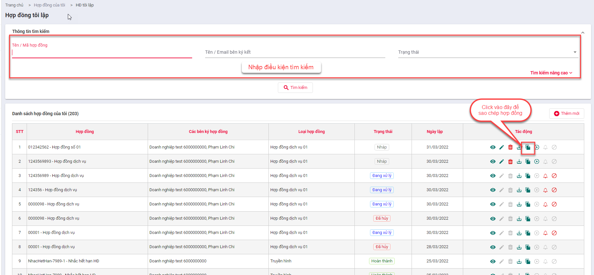
- **Bước 2**: Chọn hợp đồng và bấm nút "Sao chép". Tùy hợp đồng được chọn lập theo hình thức Chọn tệp từ máy hay chọn từ mẫu hệ thống sẽ hiển thị ra màn hình tương ứng.

  - Nếu **Chọn tệp từ máy ->** Chuyển màn hình bước 3 và có nút "Chọn tệp từ máy" để chọn file hợp đồng.
    
  - Nếu **Chọn từ mẫu ->** Chuyển màn hình bước 1, các thông tin ở màn hình bước 1 và màn hình bước 2 được giữu nguyên như sao chép.

- **Bước 3**: Các bước tiếp theo tương tự khi Lập hợp đồng.

### **Hướng dẫn Cấu hình chân ký khi Lập hợp đồng**

- **Bước 1**: Truy cập hệ thống, vào menu Hợp đồng tôi lập **->** Lập hợp đồng: Hệ thống hiển thị màn hình Lập hợp đồng **->** chọn nút "Chọn tệp từ máy".
  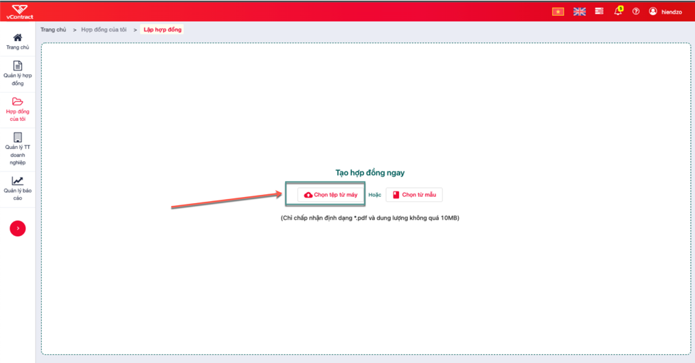
- **Bước 2**: Hệ thống hiển thị popup chọn tệp từ máy, người dùng chọn Tệp để update, Tệp ở định dang PDF và không quá 10M.
- **Bước 3**: Sau khi tải file thành công, hệ thống hiển thị màn hình Nhập thông tin chung.
  

  - **Trong đó:**
    - **(1) Nhập thông tin chung:**
      - Mẫu hợp đồng: Hiển thị tên mẫu hợp đồng đã chọn ở bước 1.
      - Loại hợp đồng: Hiển thị laoị hợp đồng của mẫu đã chọn.
      - Tên hợp đồng/phụ lục: đây là tên của hợp đồng đang lập - bắt buộc nhập.
      - Mã hợp đồng/phụ lục: đây là mã của hợp đồng đang lập - bắt buộc nhập, không được nhập trùng, không có khoảng trắng.
    - **(2) Danh sách tệp đính kèm:** Tải các tệp đính kèm - Chỉ chấp nhận tập tin PDF (_.pdf) và tập tin hình ảnh (_.jbg, _.png, _.bmp).
    - **(3) Các bên ký hợp đồng:** THiết lập các bên thực hiện ký hợp đồng, có 1 bên lập và nhiều bên khách hàng. Phải có ít nhất 1 đối tượng ký hợp đồng.
      - Nhập đúng thông tin email/số điện thoại/Tên khách hàng/số giấy tờ của bên ký kết để hệ thống suggest thông tin.
    - **(4) Thiết lập luồng duyệt - ký hợp đồng nội bộ:** Yêu cầu thiết lập thành viên trong nội bộ thực hiện ký, sẽ có nhiều người duyệt nhưng chỉ có 1 người ký.
      - Nhập đúng email để suggest thông tin thành viên.

- **Bước 4**: Sau khi điền thông tin và thiết lập luồng ký ở bước 1, bấm "Tiếp theo" **->** Chuyển đến màn hình.
  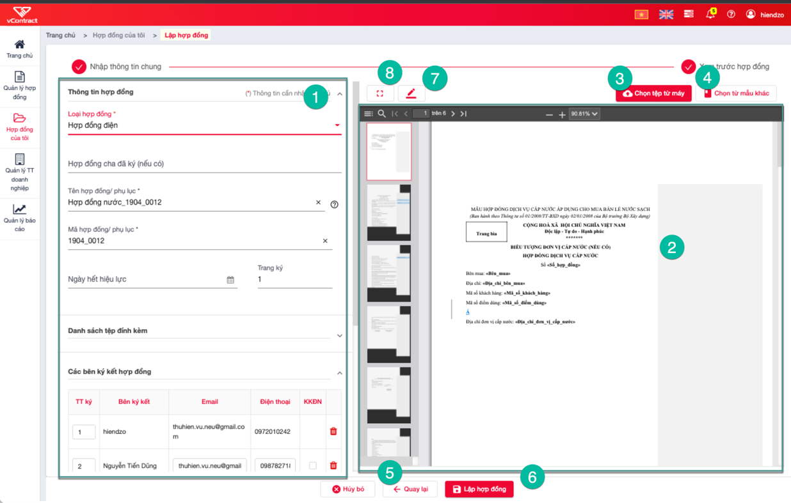
  - **Trong đó:**
    - (1) Thông tin chung của hợp đồng - đã nhập ở bước 2. Có thể chỉnh sửa.
    - (2) Xem trước hợp đồng - đây là bản xem trước hợp đồng đã upload.
    - (3) Nút **Chọn hợp đồng khác ->** Bấm vào để thực hiện chọn hợp đồng khác để thay thế hợp đồng đã upload ở bước 1.
    - (4) Nút **Chọn từ mẫu khác ->** Bấm vào để thực hiện chọn mẫu khác để thay đổi hình thức lập hợp đồng sang **Chọn từ mẫu**.
    - (5) Nút **quay lại ->** Bấm để quay lại màn hình bước 2.
    - (6) Nút **Lập hợp đồng ->** Bấm để thực hiện Lập hợp đồng.
    - (7) Nút **Cấu hình chân ký ->** Chuyển sang màn hình cấu hình chân ký.
    - (8) Nút Mở rộng vùng văn bản.
- **Bước 5**: Bấm Nút "Cấu hình chân ký" để mở màn hình cấu hình chân ký.
  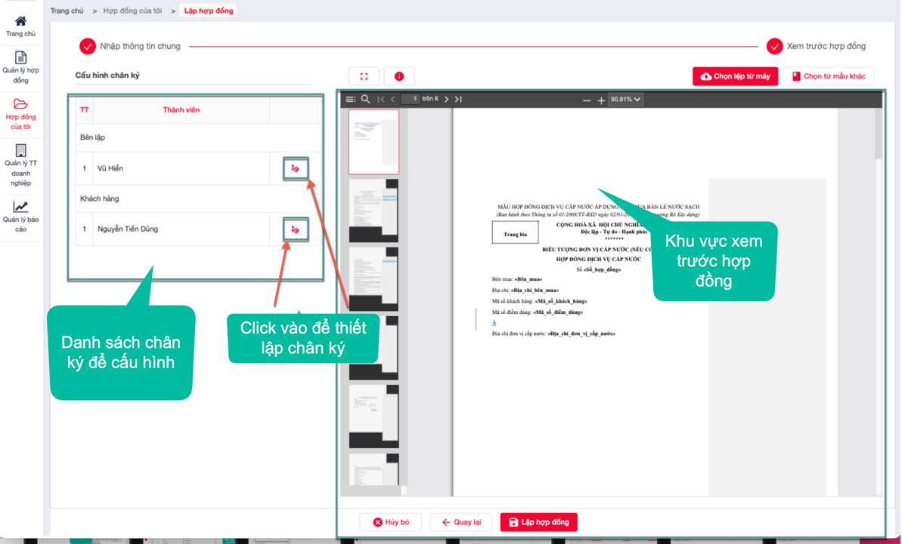
  - Người dùng bấm  để Thêm chân ký, bấm vào sẽ hiển thị khung chữ ký, thực hiện di chuyển và thả để chọn vị trí chân ký.
  - Chân ký sau khi thiết lập.
    
  - Để thay đổi vị trí chân ký: Có thể di chuột vào khung chân ký và thực hiện kéo thả.
  - Để **Xóa cấu hình chân cký:** Bấm icon  để xóa cấu hình chân ký.
- **Bước 6**: Sau khi cấu hình chân ký bấm **Lập hợp đồng ->** Thực hiện lưu hợp đồng ở trạng thái Nháp.

### **Thực hiện luồng ký hợp đồng**

Sau khi đã soạn thảo hoàn tất 1 hợp đồng, người lập chuyển hợp đồng đến các bên ký kết bằng chức năng Thực hiện luồng ký, các bước thực hiện như sau

- **Bước 1**: Chọn menu chính "Hợp đồng của tôi" (nemu trái).
- **Bước 2**: Chọn menu chức năng "Hợp đông tôi lập".
- **Bước 3**: Click icon "Thực hiện luồng ký" của hợp đồng cần chuyển.
- **Bước 4**: Click "Đồng ý" để xác nhận chuyển xử lý hợp đồng.
  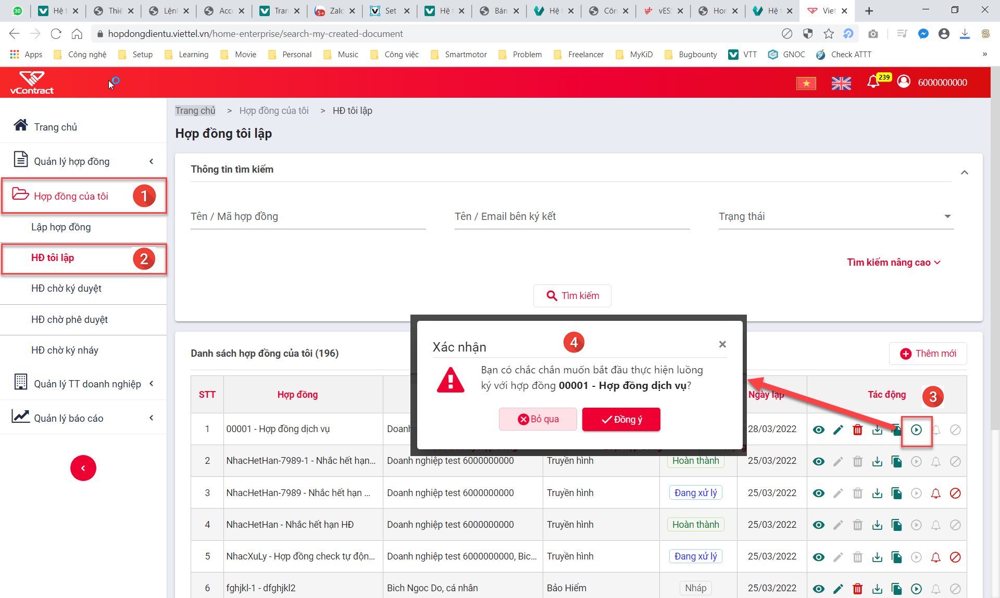

### **Ký hợp đồng**

- **Mục đích:** Sử dụng cho người dùng có yêu cầu ký hợp đồng.

- **Các bước thực hiện:**

  - **Bước 1:** Hợp đồng của tôi >> HĐ chờ ký duyệt >> Xem chi tiết.
    
  - **Bước 2:** Từ màn hình xem chi tiết tài liệu chọn  >> chọn vị trí ký:
    
    **Lưu ý:** Người dùng có thể thực hiện ký theo lô cho các hợp đồng chưa được ký.
    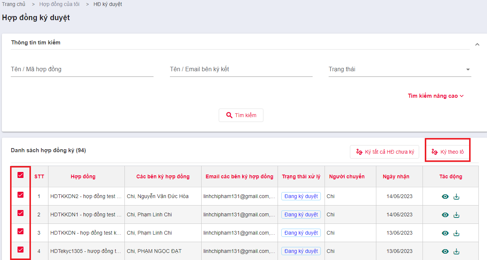

#### **Ký bằng USB Token**

- **Cách 1: Sử dụng ảnh chứng thư số đã đăng ký:**

  Tại màn hình "Ký số hợp đồng" >> Chọn phương thức ký "USB TOKEN" >> chọn chứng thư số >> nhấn "Tiếp theo" >> Tab "Ảnh đã đăng ký" >> nhấn "Tiếp theo" >> Click để chọn vị trí hiển thị ảnh ký trên hợp đồng >. nhấn "Ký" để thực hiện ký thành công.

- **Cách 2: Vẽ ảnh chữ ký:**

  - Tại màn hình "Ký số hợp đồng" >> Chọn phương thức ký "USB TOKEN" >> Chọn chứng thư số >> nhấn "Tiếp theo" >> Tab "Vẽ chữ ký" thực hiện di chuột để vẽ chữ ký mong muốn >> Nhấn "Tiếp theo" >> Click để chọn vị trí hiển thị ảnh ký trên hợp đồng >> Nhấn "Ký" để thực hiện ký thành công.
  - Hệ thống thông báo "Ký hợp đồng thành công" để hoàn thành thao tác ký.

- **Cách 3: Tải ảnh mới**

  - Tại màn hình "Ký số hợp đồng" >> Chọn phương thức ký "USB TOKEN" >> Chọn chứng thư số >> Nhấn "Tiếp theo" >> Tab "Tải ảnh mới lên" nhấn chuột vào ô chữ nhật để tải ảnh mới cho phương thức ký đã chọn >> Nhấn "Tiếp theo" >> Click để chọn vị trí hiển thị ảnh ký trên hợp đồng >> Nhấn "Ký" để thực hiện ký thành công.
  - Hệ thống thông báo "Ký hợp đồng thành công" để hoàn thành thao tác ký.

#### **Ký bằng SIM CA**

- **Cách 1: Sử dụng ảnh chứng thư số đã đăng ký:**
  Tại màn hình "Ký số hợp đồng" >> Chọn phương thức ký "SIMCA" >> Chọn chứng thư số >> Nhấn "Tiếp theo" >> Tab "Ảnh đã đăng ký" >> Nhấn "Tiếp theo" >> Click để chọn vị trí hiển thị ảnh ký trên hợp đồng >> Nhấn "Ký" để thực hiện ký thành công.
- **Cách 2: Vẽ ảnh chữ ký:**
  - Tại màn hình "Ký số hợp đồng" >> Chọn phương thức ký "SIMCA" >> Chọn chứng thư số >> Nhấn "Tiếp theo" >> Tab "Vẽ chữ ký" thực hiện di chuột để vẽ chữ ký mong muốn >> Nhấn "Tiếp theo" >> Click để chọn vị trí hiển thị ảnh ký trên hợp đồng >> Nhấn "Ký" để thực hiện ký thành công.
  - Hệ thống thông báo "Ký hợp đồng thành công" để hoàn thành thao tác ký.
- **Cách 3: Tải ảnh mới**
  - Tại màn hình "Ký số hợp đồng" >> Chọn phương thức ký "SIMCA" >> chọn chứng thư số >> Nhấn "Tiếp theo" >> Tab "Tải ảnh mới lên" nhấn chuột vào ô chữ nhật để tải ảnh mới cho phương thức ký đã chọn >> Nhấn "Tiếp theo" >> Click để chọn vị trí hiển thị ảnh ký trên hợp đồng >> Nhấn "Ký" để thực hiện ký thành công.
  - Hệ thống thông báo "Ký hợp đồng thành công" để hoàn thành thao tác ký.

#### **Ký bằng Cloud CA**

- **Cách 1: Sử dụng ảnh chứng thư số đã đăng ký:**
  Tại màn hình "Ký số hợp đồng" >> Chọn phương thức ký "Ký số từ xa" >> Chọn chứng thư số >> Nhấn "Tiếp theo" >> Tab "Ảnh đã đăng ký" >> Nhấn "Tiếp theo" >> Click để chọn vị trí hiển thị ảnh ký trên hợp đồng >> Nhấn "Ký" để thực hiện ký thành công.

- **Cách 2: Vẽ ảnh chữ ký:**

  - Tại màn hình "Ký số hợp đồng" >> Chọn phương thức ký "Ký số từ xa" >> Chọn chứng thư số >> Nhấn "Tiếp theo" >> Tab "Tải ảnh mới lên" nhấn chuột vào ô chữ nhật để tải ảnh mới cho phương thức ký đã chọn >> Nhấn "Tiếp theo" >> Click để chọn vị trí hiển thị ảnh ký trên hợp đồng >> Nhấn "Ký" để thực hiện ký thành công.
  - Hệ thống thông báo "Ký hợp đồng thành công" để hoàn thành thao tác ký.

- **Cách 3: Tải ảnh mới**
  - Tại màn hình "Ký số hợp đồng" >> Chọn phương thức ký "Ký số từ xa" >> Chọn chứng thư số >> Nhấn "Tiếp theo" >> Tab "Tải ảnh mới lên" nhấn chuột vào ô chữ nhật để tải ảnh mới cho phương thức ký đã chọn >> Nhấn "Tiếp theo" >> Click để chọn vị trí hiển thị ảnh ký trên hợp đồng >> Nhấn "Ký" để thực hiện ký thành công.
  - Hệ thống thông báo "Ký hợp đồng thành công" để hoàn thành thao tác ký.

#### **Ký bằng phương thức OTP**

**Lưu ý:** Chỉ áp dụng với người ký là **Khách hàng cá nhân**.

- **Bước 1:** Đăng nhập vào tài khoản khách hàng cá nhân >> Hợp đồng của tôi >> HĐ chờ ký duyệt:
- **Bước 2:** Từ màn hình xem chi tiết hợp đồng chọn 
- **Bước 3:** Thực hiện ký:
  - **Cách 1: Sử dụng ảnh chứng thư số đã đăng ký:**
    - Tại màn hình "Ký số hợp đồng" >> Chọn phương thức ký "Xác thực OTP" >> Chọn số điện thoại ký OTP >> Nhấn "Tiếp theo" >> Tab "Ảnh đã đăng ký" >> Nhấn "Tiếp theo" >> Cick để chọn vị trí hiển thị ảnh ký trên hợp đồng >> Nhấn "Ký" để thực hiện ký.
      
    - Nhập Mã xác thực về số điện thoại đăng ký phương thức ký OTP >> Nhấn "Xác nhận" để hoàn thành việc ký hợp đồng:
      
    - Nhập Mã xác thực gửi về số điện thoại đăng ký phương thức ký OTP >> Nhấn "Xác nhận" để hoàn thành việc ký hợp đồng:
      
  - **Cách 2: Vẽ ảnh chữ ký:**
    - Tại màn "Ký số hợp đồng" >> Chọn phương thức ký "Xác thực OTP" >> Chọn số điện thoại ký OTP >> Nhấn "Tiếp theo" >> Tab "Vẽ chữ ký" thực hiện di chuột để vẽ chữ ký mong muốn >> Nhấn "Tiếp theo" >> Click để chọn vị trí hiển thị ảnh ký trên hợp đồng >> Nhấn "Ký" để thực hiện ký.
      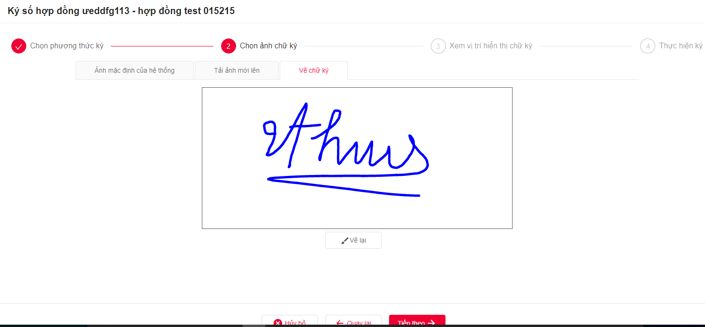
    - Hệ thống thông báo "Ký hợp đồng thành công" để hoàn thành thao tác ký.
  - **Cách 3: Tải ảnh mới**
    - Tại màn hình "Ký số hợp đồng" >> Chọn phương thức ký "Xác thực OTP" >> Chọn số điện thoại ký OTP >> Nhấn "Tiếp theo" >> Tab "Tải ảnh mới lên" nhấn chuột vào ô chữ nhật để tải ảnh mới cho phương thức ký đã chọn >> Nhấn "Tiếp theo" >> Click để chọn vị trí hiển thị ảnh ký trên hợp đồng >> Nhấn "Ký" để thực hiện ký.
    - Hệ thống thông báo "Ký hợp đồng thành công" để hoàn thành thao tác ký.
      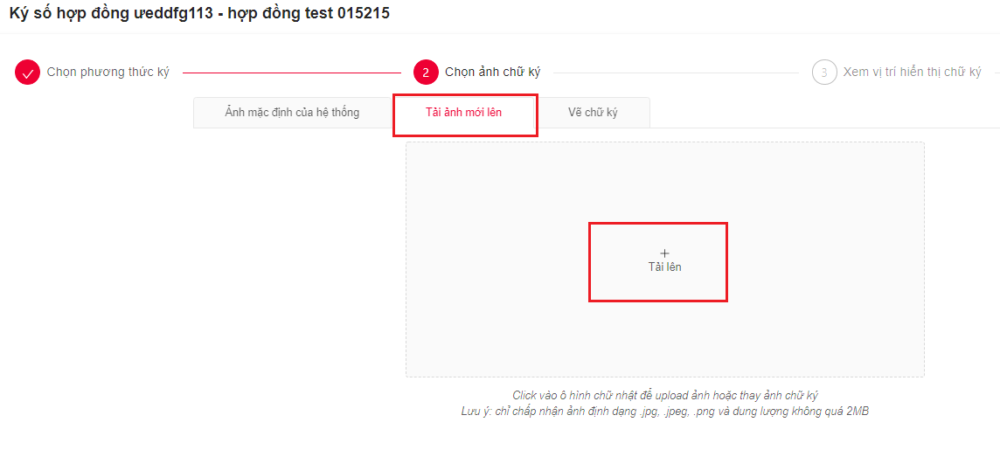

### **Hợp đồng số hóa**

**Mục đích:** Sử dụng cho người dùng có yêu cầu quản lý các hợp đồng giấy upload lên trên phần mềm Hợp đồng điện tử để lưu trữ số hóa.

**Các bước thực hiện:**

- **Bước 1:** Thực hiện truy cập **Quản lý hợp đồng** >> **Hợp đồng số hóa**.
  
- **Bước 2:** Tạo **"Thêm mới"**
  - Chọn tải file lên phần mềm: Hệ thống nhận các định dạng file doc/pdf/rar và dung lượng không quá 100MB
  - Người dùng điền đầy đủ các trường thồn tin sau: Loại hợp đồng, hợp đồng gốc (nếu có), tên hợp đồng, mã hợp đồng, ngày hiệu lực, ngày hết hiệu lực.
  - Người dùng có thể upload nhiều file theo 1 bộ hợp đồng. Và thực hiện lập hợp đồng.

  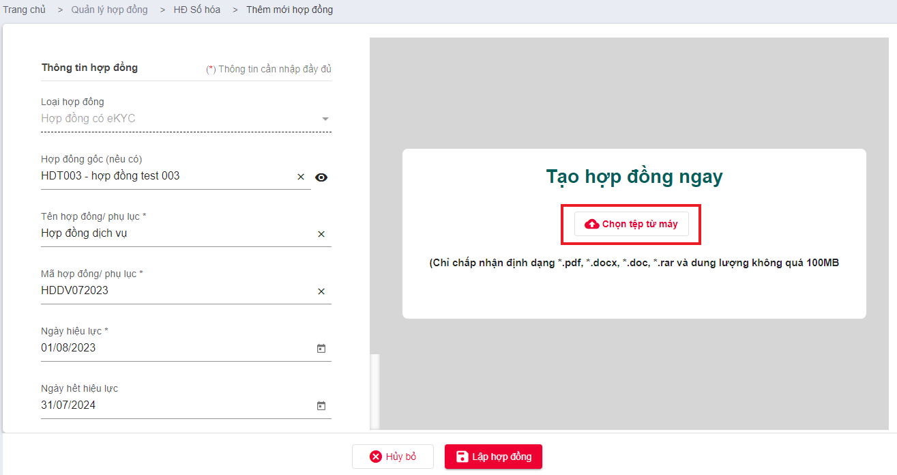

- **Bước 3:** Sau khi upload hợp đồng giấy lên phần mềm thành công, người dùng có thể thực hiện các thao tác: xem, sửa, tải, xóa. Và dễ dàng tìm kiếm hợp đồng theo các thông tin thiết lập ban đầu.
  

### **Hợp đồng cần xác nhận**

**Mục đích:** Sử dụng trong TH doanh nghiệp ký bằng CTS trước, bên nhận hợp đồng ký bằng OTP sau và cần DN xác nhận ký lại một lần nữa để đảm bảo tính pháp lý cho hợp đồng.

**Các bước thực hiện:**

- **Bước 1:** Thực hiện truy cập **Hợp đồng của tôi** >> **HĐ cần xác nhận**.
  
- **Bước 2:** Thực hiện  **Xem chi tiết**. Người dùng kiểm tra lại hợp đồng và số chữ ký OTP trên hợp đồng cần xác nhận.
  
- **Bước 3:** Thực hiện **Ký xác nhận**
  - Thực hiện đăng ký phương thức ký.
    
  - Người dùng chọn CTS để thực hiện ký.
    
  - Sau khi doanh nghiệp ký xác nhận thành công, hệ thống sẽ trả về kết quả Hợp đồng ở trạng thái Hoàn thành và có giá trị.
    
    
