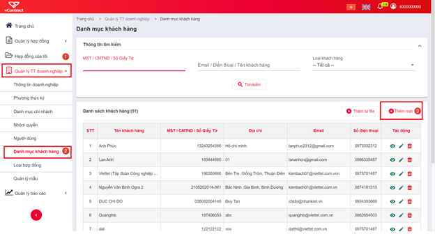
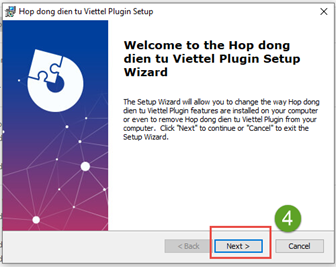
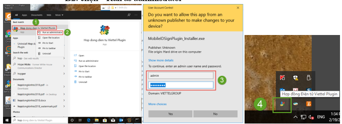
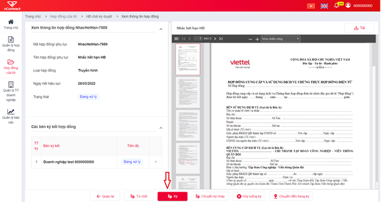
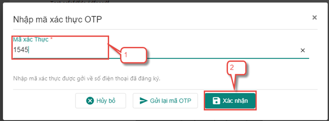

# Thiết lập luồng ký hợp đồng

## Cấu hình trước khi sử dụng dịch vụ
Admin của chủ thể ký kết thực hiện cấu hình các thông tin dưới đây trước khi sử dụng

### Thiết lập loại hợp đồng 

- **Loại Hợp Đồng**: dùng để phân nhóm các hợp đồng của đơn vị, hỗ trợ cho tìm kiếm và cấu hình các chức năng khác trong hệ thống.

- **Hệ thống quy định**: mỗi đơn vị sử dụng dịch vụ có ít nhất 1 loại hợp đồng, các chủ thể là khách hàng cuối chỉ thực hiện ký hợp đồng không thực hiện chức năng này.

- **Các bước thiết lập loại hợp đồng**: 
1. Chọn menu chính **Quản lý TT doanh nghiệp** (menu trái)
2. Chọn menu chức năng **Loại hợp đồng**
3. Nhấn nút **Thêm mới**
4. Điền thông tin Loại hợp đồng của đơn vị cần sử dụng => Nhấn **Thêm loại hợp đồng**

### Thiết lập mẫu hợp đồng

- **Mẫu Hợp Đồng**: cho phép nhân viên đơn vị thiết lập nhanh hợp đồng, ko cần soạn thảo sẵn tại máy tính.

- Đơn vị có thể tùy chọn sử dụng Mẫu hoặc không, hiện hệ thống có 8 mẫu cố định để đơn vị lựa chọn.

- **Các bước thiết lập loại hợp đồng**:
  1. Chọn menu chính “Quản lý TT doanh nghiệp” (menu trái)
  
  2. Chọn menu chức năng **Mẫu hợp đồng**
  
  3. Nhấn nút **Thêm mới**
  
  4. Chọn một mẫu có sẵn của hệ thống > Điền thông tin Mẫu hợp đồng của đơn vị cần sử dụng > Nhấn **Thêm mẫu**

### **Thiết lập phương thức ký**

- **Phương thức ký**: Là hình thức ký số mà đơn vị sử dụng để ký hợp đồng.

- **Hệ thống quy định**: 
  - Đơn vị tham gia ký kết là Doanh nghiệp/Tổ chức  thì **bắt buộc** ký bằng **CA** (usbtoken, sim Ca hoặc HSM).
  - Đơn vị tham gia ký kết là Cá nhân thì **có thể** ký bằng **CA** (usbtoken, sim CA hoặc HSM) hoặc **OTP**.
  
- **Các bước thiết lập phương thức ký**:
  1. Chọn menu chính **Quản lý TT doanh nghiệp** (menu trái)
  
  2. Chọn menu chức năng **Phương thức ký**
  
  3. Nhấn nút **Thêm mới**
  
  4. Điền thông tin 1 hình thức ký > Nhấn **Lưu**

Ngoài ra, người dùng có thể thiết lập nhanh Phương thức ký trên trực tiếp trang ký 1 hợp đồng (tương đương bước 4)

### **Thiết lập nhóm quyền - Tạo người dùng của đơn vị**

- **Nhóm quyền – Người dùng**: cấp tài khoản người dùng và quyền thao tác cho các nhân viên của đơn vị sử dụng dịch vụ. Với nhiều người dùng, đơn vị có thể cấu hình động người phê duyệt / ký duyệt / ký nháy các hợp đồng của mình.

- **Hệ thống quy định**: chức năng này chỉ áp dụng cho đơn vị sử dụng dịch vụ Hợp đồng điện tử, không áp dụng cho khách hàng cuối chỉ tham gia ký kết

- **Các bước thiết lập Nhóm quyền, Người dùng**:
  1. Chọn menu chính **Quản lý TT doanh nghiệp** (menu trái)
  
  2. Chọn menu chức năng **Nhóm quyền** hoặc **Người dùng**
  
  3. Nhấn nút **Thêm mới**
  
  4. Điền thông tin Nhóm quyền, Người dùng > Nhấn **Thêm nhóm quyền** / **Thêm người dùng**

### **Tạo khách hàng/đối tác ký kết**

- **Khách hàng / Đối tác**: được hiểu là bên tham gia ký kết hợp đồng với đơn vị sử dụng dịch vụ Hợp đồng điện tử. Khi đơn vị sử dụng dịch vụ khởi tạo ký 1 hợp đồng, đơn vị đồng thời tạo tài khoản cho các bên tham gia này (nếu tài khoản chưa tồn tại)

- **Hệ thống quy định**: chức năng này chỉ áp dụng cho đơn vị sử dụng dịch vụ Hợp đồng điện tử, không áp dụng cho khách hàng cuối chỉ tham gia ký kết. Các thông tin của khách hàng khi khởi tạo phải đúng, hợp pháp, hợp lệ.

- **Các bước tạo Khách hàng**:
1. Chọn menu chính **Quản lý TT doanh nghiệp** (menu trái)
2. Chọn menu chức năng **Danh mục khách hàng**
3.  Nhấn nút **Thêm mới**
  
4. Điền thông tin Khách hàng
5.  Nhấn **Thêm khách hàng**

Ngoài ra, người dùng có thể thêm nhanh khách hàng trên trang lập hợp đồng (tương đương bước 4 & 5)

## **Chuẩn bị công cụ kết nối usbtoken**
Để thực hiện thiết lập Phương thức ký hoặc Ký số hợp đồng bằng usb token, người dùng thao tác cần đáp ứng:

- Có chứng thư số hợp lệ, còn thời hạn sử dụng.

- Máy tính thao tác phải nhận được usbtoken cần sử dụng (Cài đặt token manager của nhà cung cấp usbtoken và xem được thông tin chứng thư số trong usb)

- Máy tính thao tác phải cài và bật plugin ký của hệ thống Hợp đồng điện tử
  - Nếu máy tính chưa cài plugin ký
    - **Tải plugin ký** theo hướng dẫn trên form Thêm mới Phương thức ký hoặc trang Ký hợp đồng 
      
      
      
    
    - **Cài đặt plugin** theo các bước sau:
      1. Nhấn chuột phải vào file cài đặt
      
      2. Chọn **Run as administrator**
      
         

3. Nhập thông tin tài khoản admin nếu có

4. Thực hiện các bước cài đặt ứng dụng plugin

- Bật plugin ký:
  1. Tìm plugin đã cài đặt + nhấn chuột phải 
  2.  Chọn  **Run as administrator**
  
  
  
  
  
  3. Nhập thông tin tài khoản admin nếu có
  4. Plugin được bật thành công ở Taskbar

Sau khi đã cài đặt, bật plugin theo các bước nêu trên, người dùng thực hiện chức năng thiết lập Phương thức ký và Ký số hợp đồng như bình thường.

##  **Thao tác trên hợp đồng**

### **Tạo hợp đồng**

**Các bước thực hiện tạo hợp đồng**:

1. Chọn menu chính **Hợp đồng của tôi** (menu trái)

2. Chọn menu chức năng **Lập hợp đồng**

3. Chọn cách lập hợp đồng: từ file pdf upload lên hoặc lập từ mẫu đã đăng ký 

4. Chọn file pdf cần upload hoặc chọn Mẫu để tạo hợp đồng 

5. Nhập các thông tin chung của hợp đồng: Tên, mã, loại hợp đồng, …

6. Thiết lập các bên ký kết:

- Chọn các bên tham gia ký kết: để thêm 1 bên ký kết phải nhập đúng số giấy tờ / mã số thuế của bên tham gia ký kết > Hệ thống hiển thị tên chủ thể cho người dùng chọn.
- Thiết lập thứ tự ký: nhập thứ tự ký cho từng chủ thể ở cột đầu tiên **TT ký**, có thể thiết lập ký song song bằng cách đặt thứ tự ký của các chủ thể bằng nhau.
- Thiết lập ký không đăng nhập (KKĐN): khi được thiết lập KKĐN, hệ thống sinh 1 link ký riêng với tài khoản tạm theo từng hợp đồng cho khách hàng tham gia ký kết > Khách hàng không cần nhớ tên, mật khẩu đăng nhập của hệ thống. Chỉ áp dụng với khách hàng ký số.

7. Thiết lập luồng phê duyệt – ký duyệt của nội bộ bên lập (nếu bên lập tham gia ký kết): 

- Thêm người vào luồng phê duyệt/ký duyệt bằng gõ tên/email của người dùng cần thêm > Hệ thống hiển thị các người dùng phù hợp với nội dung nhập vào để người lập chọn
- Thứ tự duyệt–ký là cố định và lần lượt: người dùng thêm vào trước luôn phê duyệt trước, người cuối cùng của luồng thực hiện chức năng ký duyệt.

8. Nhấn nút **Lập hợp đồng** > Hệ thống kiểm tra và lập hợp đồng ở trạng thái **Nháp**

### **Thực hiện luồng ký hợp đồng**

Sau khi đã soạn thảo hoàn tất 1 hợp đồng, người lập chuyển hợp đồng đến các bên ký kết bằng chức năng Thực hiện luồng ký, các bước thực hiện như sau:

1. Chọn menu chính **Hợp đồng của tôi** (menu trái)

2. Chọn menu chức năng **Hợp đồng tôi lập**

3. Nhấn icon **Thực hiện luồng ký** của hợp đồng cần chuyển 

4. Nhấn **Đồng ý** để xác nhận chuyển xử lý hợp đồng

### **Ký hợp đồng**

- **Mục đích**: Sử dụng cho người dùng có yêu cầu cần ký hợp đồng.

- **Các bước thực hiện**:
  1. Hợp đồng của tôi > HĐ chờ ký duyệt > Xem chi tiết:

  
  
  
  
  
  
  
  
  2. Từ màn hình xem chi tiết tài liệu chọn nút Ký > Chọn vị trí ký:

#### **Ký bằng USB Token**

- **Cách 1: Sử dụng ảnh chứng thư số đã đăng ký:** 

  - Tại màn hình **Ký số hợp đồng** > Chọn phương thức ký **USB TOKEN** > Chọn chứng thư số > nhấn **Tiếp theo** > Tab **Ảnh đã đăng ký** > Nhấn **Tiếp theo** > Nhấn chọn vị trí hiển thị ảnh ký trên hợp đồng > Nhấn **Ký** để thực hiện ký thành công.

- **Cách 2: Vẽ ảnh chữ ký**:
  - Tại màn hình**Ký số hợp đồng** > Chọn phương thức ký **USB TOKEN** > Chọn chứng thư số > Nhấn **Tiếp theo** > Tab **vẽ chữ ký** thực hiện di chuột để vẽ chữ ký mong muốn > Nhấn **Tiếp theo** > Click để chọn vị trí hiển thị ảnh ký trên hợp đồng > Nhấn **Ký** để thực hiện ký thành công
  - Hệ thống thông báo **Ký hợp đồng thành công** để hoàn thành thao tác ký.
- ` `**Cách 3: Tải ảnh mới**
  - Tại màn hình **Ký số hợp đồng**  > Chọn phương thức ký **USB TOKEN** > Chọn chứng thư số > Nhấn **Tiếp theo** > Tab  **Tải ảnh mới lên** nhấn chuột vào ô chữ nhật để tải ảnh mới cho phương thức ký đã chọn > Nhấn **Tiếp theo** > Click để chọn vị trí hiển thị ảnh ký trên hợp đồng > Nhấn **Ký** để thực hiện ký thành công
  - Hệ thống thông báo **Ký hợp đồng thành công** để hoàn thành thao tác ký.

#### **Ký bằng SIMCA**

- **Cách 1: Sử dụng ảnh chứng thư số đã đăng ký:** 

Tại màn hình **Ký số hợp đồng** > Chọn phương thức ký **SIMCA** >> chọn chứng thư số >> nhấn **Tiếp theo**> Tab **Ảnh đã đăng ký** >> Nhấn **Tiếp theo** > Click để chọn vị trí hiển thị ảnh ký trên hợp đồng > Nhấn **Ký** để thực hiện ký thành công.

- **Cách 2: Vẽ ảnh chữ ký**:
  - Tại màn hình **Ký số hợp đồng** > Chọn phương thức ký **SIMCA** > Chọn chứng thư số > Nhấn **Tiếp theo** > Tab  **vẽ chữ ký** thực hiện di chuột để vẽ chữ ký mong muốn > Nhấn **Tiếp theo** > Click để chọn vị trí hiển thị ảnh ký trên hợp đồng > Nhấn **Ký** để thực hiện ký thành công
  - Hệ thống thông báo **Ký hợp đồng thành công** để hoàn thành thao tác ký.                                                                                                                                                                                                                                                                                                                                  
- ` `**Cách 3: Tải ảnh mới**
  - Tại màn hình **Ký số hợp đồng** > Chọn phương thức ký **SIMCA** > Chọn chứng thư số > Nhấn **Tiếp theo** > Tab **Tải ảnh mới lên** nhấn chuột vào ô chữ nhật để tải ảnh mới cho phương thức ký đã chọn > Nhấn **Tiếp theo** > Click để chọn vị trí hiển thị ảnh ký trên hợp đồng > Nhấn **Ký** để thực hiện ký thành công
  - Hệ thống thông báo **Ký hợp đồng thành công** để hoàn thành thao tác ký.

#### **Ký bằng phương thức OTP**

  **Lưu ý :** Chỉ áp dụng với người ký là **Khách hàng cá nhân**

**Các bước thực hiện**: 

- **Bước 1:**  Đăng nhập vào tài khoản khách hàng cá nhân > Hợp đồng của tôi > HĐ chờ ký duyệt: 

- **Bước 2**: Từ màn hình xem chi tiết hợp đồng chọn nút **Ký**
- **Bước 3**: Thực hiện ký: 
- **Cách 1: Sử dụng ảnh chứng thư số đã đăng ký:**
  - Tại màn hình **Ký số hợp đồng** > Chọn phương thức ký **xác thực OTP** > Chọn số điện thoại ký OTP > Nhấn **Tiếp theo** > Tab **Ảnh đã đăng ký** > nhấn **Tiếp theo** > Nhấn để chọn vị trí hiển thị ảnh ký trên hợp đồng > Nhấn **Ký** để thực hiện ký.
  - Nhập Mã xác thực gửi về số điện thoại đăng ký phương thức ký OTP > Nhấn **Xác nhận** để hoàn thành việc ký hợp đồng:

- **Cách 2: Vẽ ảnh chữ ký**:
  - Tại màn hình **Ký số hợp đồng**  > Chọn phương thức ký **xác thực OTP** > Chọn số điện thoại ký OTP > Nhấn **Tiếp theo**  > Tab **Vẽ chữ ký** thực hiện di chuột để vẽ chữ ký mong muốn > Nhấn **Tiếp theo** > Click để chọn vị trí hiển thị ảnh ký trên hợp đồng > Nhấn **Ký** để thực hiện ký.
  - Nhập mã xác thực gửi về điện thoại lên form xác thực  > Nhấn **Xác thực** để hoàn thành việc ký hợp đồng:

- Hệ thống thông báo **Ký hợp đồng thành công** để hoàn thành thao tác ký.
- ` `**Cách 3: Tải ảnh mới**
  - Tại màn hình **Ký số hợp đồng**  > Chọn phương thức ký **Xác thực OTP** > Chọn số điện thoại ký OTP > Nhấn **Tiếp theo**  > Tab **Tải ảnh mới lên** nhấn chuột vào ô chữ nhật để tải ảnh mới cho phương thức ký đã chọn > Nhấn **Tiếp theo** > Click để chọn vị trí hiển thị ảnh ký trên hợp đồng > Nhấn **Ký** để thực hiện ký.
  - Nhập mã xác thực gửi về điện thoại lên form xác thực > Nhấn **Xác thực** để hoàn thành việc ký hợp đồng:

- Hệ thống thông báo **Ký hợp đồng thành công** để hoàn thành thao tác ký.
